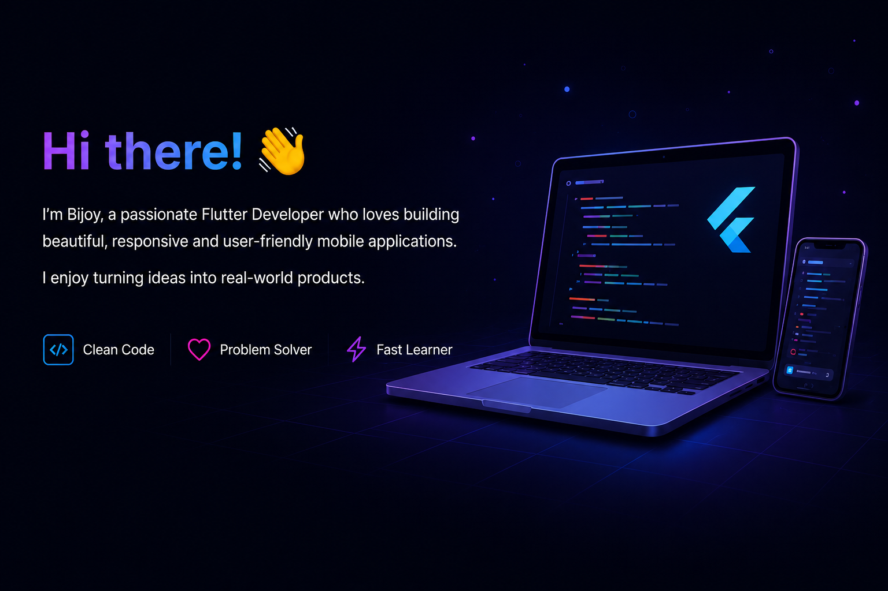

<!-- ========================= HEADER ========================= -->

  

<h1 align="center">
Hi 👋 I'm Bijoy Raju
</h1>

<h3 align="center">
Flutter Developer • Backend Enthusiast • Clean Architecture • Mobile App Developer
</h3>

---

# 👨‍💻 About Me

- 📱 Senior Flutter Developer
- 💙 Passionate about Clean Architecture
- 🚀 Building scalable mobile applications
- 🌱 Currently learning System Design & DevOps
- 🔥 Love solving real-world problems
- 📍 Mysore, India

---

# ⚡ Tech Stack

---

# 📌 Featured Projects

| Project | Description |
|---------|-------------|
| 🚀 Dazzles ERP | Textile ERP Solution |
| 📱 LoopCall | Real-time Calling App |
| 🍕 Pizza Loyalty | Flutter + Node Backend |

---

# 🌍 Connect With Me

---

<h3 align="center">
Thanks for visiting my profile! 😊
</h3>

